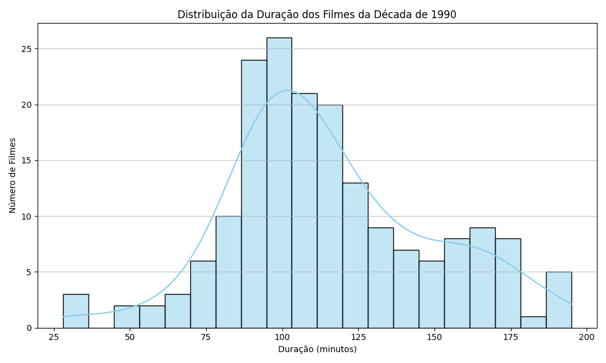
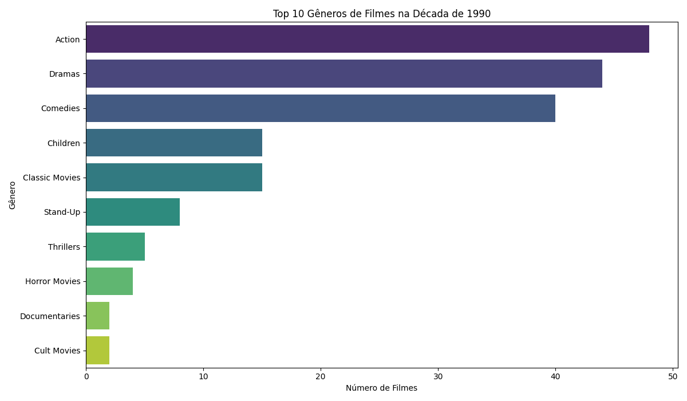

# Projeto: Análise de Dados da Netflix (Netflix Data Analysis)

## Visão Geral do Projeto

Este é um projeto de análise de dados exploratória (EDA) que investiga um subconjunto específico do catálogo da Netflix. O foco principal é a identificação e contagem de filmes que atendem a critérios específicos de lançamento, gênero e duração. Desenvolvido como parte do aprendizado em ciência de dados com Python, este projeto também demonstra habilidades de visualização de dados.

## Conjunto de Dados

O conjunto de dados utilizado é `netflix_data.csv`, contendo informações detalhadas sobre filmes e séries disponíveis na plataforma Netflix.

| Coluna         | Descrição                                   |
| :------------- | :------------------------------------------ |
| `show_id`      | O ID do show                                |
| `type`         | Tipo de show (Filme ou Série)               |
| `title`        | Título do show                              |
| `director`     | Diretor do show                             |
| `cast`         | Elenco do show                              |
| `country`      | País de origem                              |
| `date_added`   | Data de adição à Netflix                    |
| `release_year` | Ano de lançamento original                  |
| `duration`     | Duração do show em minutos (para filmes)    |
| `description`  | Descrição do show                           |
| `genre`        | Gênero do show                              |

## Funcionalidade do Script

O script `netflix_analysis.py` realiza as seguintes operações:

1.  **Carregamento de Dados:** Carrega o dataset `netflix_data.csv` para um DataFrame Pandas.
2.  **Filtragem de Tipo:** Exclui séries, focando a análise exclusivamente em filmes.
3.  **Tratamento de Dados Ausentes:** Lida com valores ausentes na coluna 'duration' (removendo-os para garantir cálculos precisos).
4.  **Filtragem por Década:** Filtra os filmes para incluir apenas aqueles lançados na década de 1990 (entre 1990 e 1999, inclusive).
5.  **Análise Específica:** Identifica a duração mais comum dos filmes dos anos 90 e conta os filmes dessa década que são do gênero 'Action' e possuem uma duração menor que 90 minutos.
6.  **Geração de Gráficos:** Cria e salva visualizações-chave sobre os filmes da década de 1990.
7.  **Saída:** Imprime a duração mais comum e a contagem final dos filmes que atendem aos critérios no console.

## Visualizações Chave

Os seguintes gráficos são gerados pelo script e salvos na pasta `images/`, oferecendo insights visuais sobre o catálogo da Netflix na década de 1990.

### Distribuição da Duração dos Filmes dos Anos 90

*Este histograma mostra a frequência de filmes de acordo com sua duração em minutos, focando na produção cinematográfica dos anos 90.*

### Top 10 Gêneros de Filmes dos Anos 90

*Este gráfico de barras ilustra os gêneros mais populares entre os filmes lançados na década de 1990.*

## Como Executar o Projeto

Para executar o script e replicar a análise, siga os passos abaixo:

1.  **Clone o Repositório:**
    ```bash
    git clone [https://github.com/SeuUsuario/datacamp-netflix-analysis.git](https://github.com/SeuUsuario/datacamp-netflix-analysis.git)
    cd datacamp-netflix-analysis
    ```
    *(Lembre-se de substituir `SeuUsuario/datacamp-netflix-analysis.git` pela URL real do seu repositório GitHub.)*
2.  **Crie e Ative um Ambiente Virtual (Recomendado):**
    ```bash
    python -m venv venv
    # No Windows (PowerShell):
    .\venv\Scripts\activate
    # No macOS/Linux (Bash/Zsh):
    source venv/bin/activate
    ```
3.  **Instale as Dependências:**
    O projeto requer as bibliotecas `pandas`, `numpy`, `matplotlib` e `seaborn`.
    ```bash
    pip install pandas numpy matplotlib seaborn
    ```
4.  **Execute o Script Python:**
    ```bash
    python netflix_analysis.py
    ```
    O script processará os dados, exibirá os resultados no console e salvará os gráficos na pasta `images/`.

## Ferramentas e Bibliotecas

* Python 3.x
* Pandas
* NumPy 
* Matplotlib 
* Seaborn 
